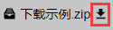
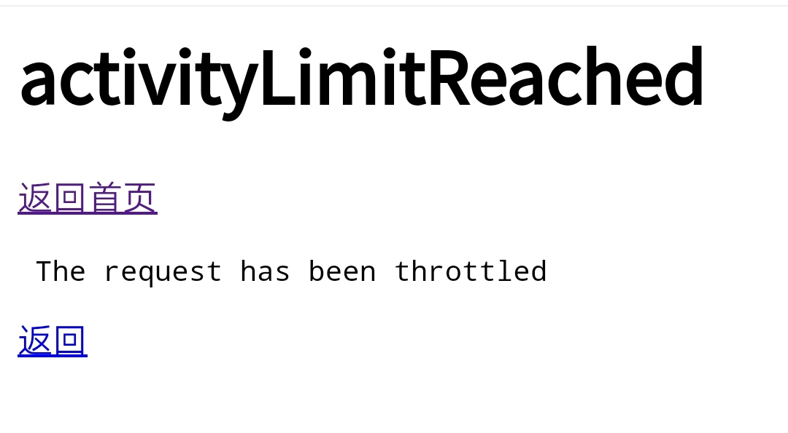

## 下载器推荐及下载
|下载地址  |
|  :----- |
|  [PC：Internet Download Manager 6.37.14 已激活 免安装.zip](https://emu.fw05.workers.dev/https://github.com/butter255/emu/releases/download/rar/Internet.Download.Manager.6.37.14.zip)  |
|  [安卓：IDM+ v15.2 for Android](https://emu.fw05.workers.dev/https://github.com/butter255/emu/releases/download/rar/Internet.Download.Manager.6.37.14.zip)  |
## 问题A:怎么下载文件？
### 解决方法a：在文件的右侧找到下载图标，单击进行下载（注：有时文件名过长，右侧图标不显示，这时应该采用其它方法）
 
### 解决方法b:单击该文件的文件名，进入文件预览界面,再单击“下载”
## 问题B:下载的文件都是"download.aspx"怎么办？
### 解决方法:对文件进行重命名，注意后缀要一起更改（比如我要下载的文件是“1.apk”,但下载之后文件却变成了"download.aspx"这时我们将文件重命名为“1.apk"就行了） 
这种问题通常出在现手机自带的浏览器上，如果不想总是改文件名，可以尝试更换一个浏览器 
### 个人推荐edge、谷歌、火狐浏览器
## 问题C：提示activityLimitReached无法下载？
 
### OneDrive API调用存在限制，短时间过量会出现此提示。
### 解决方法：切换下载线路
## 问题D：总是链接失效下载失败怎么办？
### OneDrive直链有效期为一小时，若文件过大或下载速度过慢可能导致失败，请使用可断点续传（不知道什么意思的自己百度）的软件下载（见下）
## 问题E:下载速度过慢怎么办？
本站为onedrive网盘站，绑定onedrive 国际版，服务器在海外，最好不要直接使用浏览器下载。 
### 解决方法a:使用专业多线程下载软件进行下载（支持断点续传）， PC 如 IDM（Internet Download Manager）、FDM（Free Download Manager）安卓如（IDM+、ADM（Advanced Download Manager），复制下载链接到/使用浏览器调用 idm、迅雷等下载工具
### 解决方法b:选择反代线路： 
利用 cloudflare workers 反向代理 onedrive 的镜像地址，线路和流量都是经过 cloudflare， 由于 cloudflare 在国内各地方各时段的连接速度和可访性各所不同，请自行测试
### 若原线路下载更快请忽略 
### 解决方法c:自备科学上网工具 