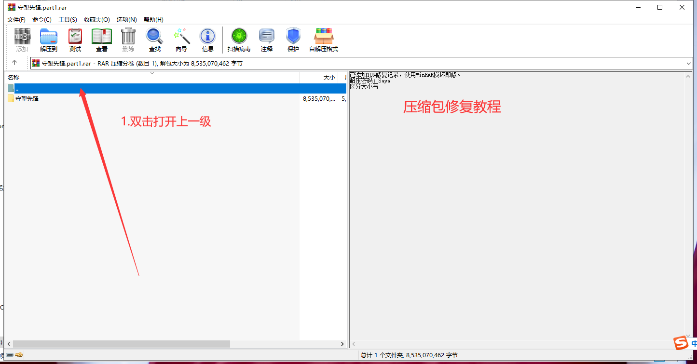
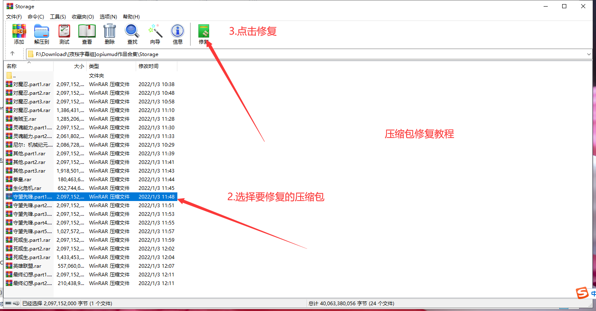

# 解压遇到问题？
## 问题A：解压出错怎么办？ 
### ① 每个合集都有一个通用解压码，不是全站通用！
### ② 可能使用了某些盗版收费软件，详情： https://tieba.baidu.com/p/6880184999 
### ③ 下载丢包。解决方法A：重新下载。
### 解决方法B：文件均添加5%恢复记录，可用rar自行修复 安卓版的rar也能修复，具体操作自己百度
# 压缩包修复教程

## PC教程

## 安卓教程
在rar中选中要修复的压缩包,点击右上角
点击修复压缩文件

